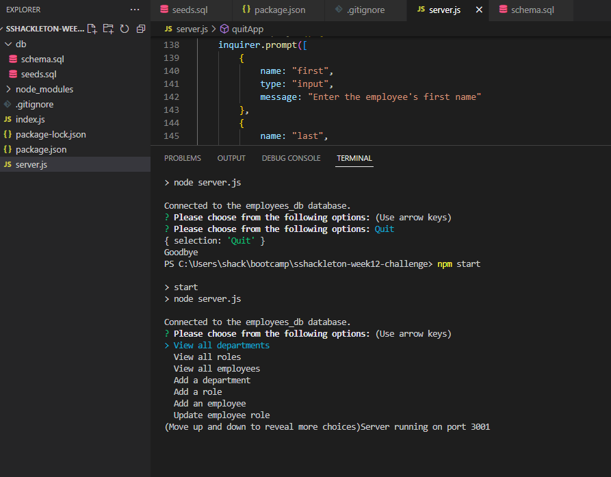
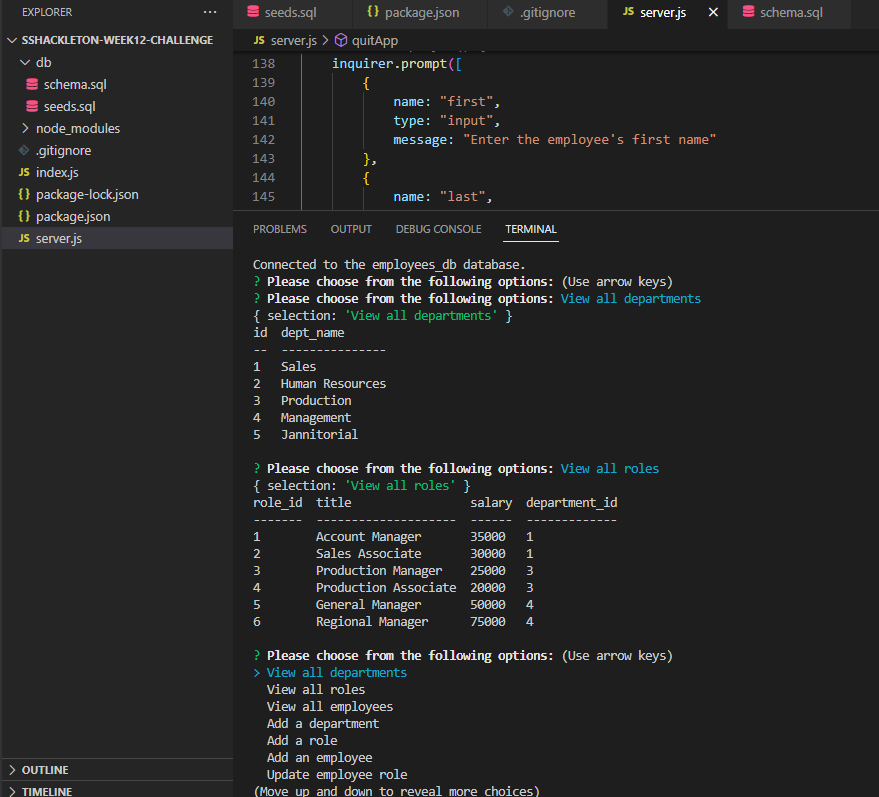

# Week 12 Challenge - SQL Employee Tracker
## Description
The purpose of this challenge was to create a Node.js based employee tracker using databases, tables and mySQL.  We needed to be able to find and add employees, roles and departments using mySQL.
## Dependencies
The user needs to have installed Inquirer, Console.Table, Express.js, Node.js, and mySQL
## Running the App
* Log into mySQL from the command line, then run "source db/schema.sql" to create the database and tables
* Next, run "source db/seeds.sql" to seed the new database and tables, then quit from mySQL
* Back on command line, and once dependencies are installed, run "npm start" to begin the app and make your choices
## Screenshots

## Link to Demo Video
https://drive.google.com/file/d/1-aHNu_N-vjh7jNZDz8cVDY1Z9j0hN1mN/view
## Shout Outs
Thank you to my instructors for this fun section, and to my classmates who helped me fix a small but app breaking bug!